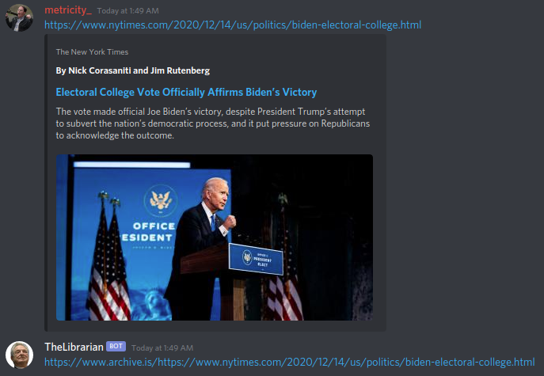
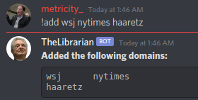
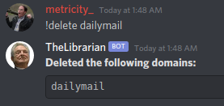
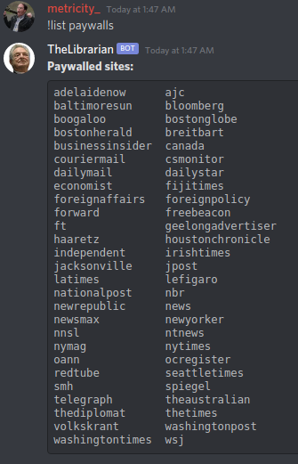

# The Librarian

### Discord bot to open paywalled articles to archive.is

Dis da meanest librarian ya ever saw'd.  Was meant to be a simple bot to translate paywalled articles to archive.is versions, but has taken on a life of it's own.

Currently lives on a RPi Zero in my janky basement.  Don't mess with me or I'll pull the plug.

### How to use

Posting any website currently on the list of paywalled sites will automatically cause the bot to respond with an archive.is link.  If the site isn't currently on the paywalled list, you can use the command `!paywall site`

To add to the list of paywalled sites, simply type `!add domain` to add that domain.

To delete from the list, use `!delete domain`.

To show a list of all paywalled sites, use `!list paywalls`

Additionally, there are quite a few easter eggs thrown in for the lulz that aren't related to getting around paywalls.